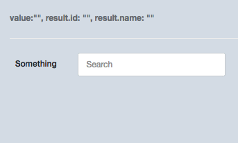

# aurelia-autocomplete

[](https://gitter.im/SpoonX/Dev)

An autocomplete component for the aurelia framework.



## Setup

### Installation

```bash
jspm install aurelia-autocomplete
```

### Configure
Simply register autocomplete as a plugin in main.js.

## Usage

> simple

```html
<auto-complete resource="language"></auto-complete>
```

*or if you have an array with items and thus would not need to perform
a request*

```js
export class Page {
  languages = [ /* languages */ ];
}
```

```html
<auto-complete items.bind="languages"></auto-complete>
```

> extended

```js
export class MyViewModel {

  results     = [];
  customLabel = product => product.name + product.barcode;
  value       = 'banana';
  productCriteria = {
    stock: {'>': 0}
  };
  defaultProduct = {
    productName: 'No product',
    productCategory   : 'none'
  };

  constructor() {
    product = this.defaultProduct;
  }

  resultsChanged(products) {
    // select the first product that has the name 'banana'. If cannot be found
    // then select the first product in the results.
    this.selected = products.find(product => product.name === 'banana') || products[0];

    // always show the no product option
    this.results = this.results.concat([this.defaultProduct]);
  }

  productSort(products) {
    products.sort((a, b) => a.price > b.price;
  }

}
```

```html

  <h4>${product.productName} ${product.productCategory}</h4>

  <auto-complete
    resource="product"
    selected.bind="selected"
    value.two-way="value"
    result.two-way="value"
    attribute="productName"
    results.bind="results"
    limit="5"
    endpoint="product-api"
    sort.bind="productSort"
    criteria.bind="{}"
    label.bind="customLabel">
  </auto-complete>

```

## Documentation

### Bindables

#### limit = 10;
The max amount of results to return. (optional)

#### name = '';
The name of the element. (optional)

#### items;
Used when one already has a list of items to filter on. Requests is not
necessary.

#### resource;
The string that is appended to the api endpoint. e.g. `language` is the
resource in following url `api.com/language`

#### value = '';
The string to be used to do a contains search with. By default it will look
if the name contains this value

#### selected;
Can be used to select default element visually

#### result;
The result object from the server, set when something was selected.

#### minInput = 0;
How many characters are required to type before starting a search.

#### footerLabel = 'Create';
The label to show in the footer. Using i18n? No problem, this automatically gets translated.

#### footerVisibility = 'never';
When to show the footer. Possible values are `never`, `always` an `no-results`.

#### footerSelected = (value) => {};
Callback that gets called with the selected value when the footer gets clicked.

#### debounce = 100;
Configure debounce value for user input.

#### populate = null;
Which relations to populate for results.

#### attribute = 'name';
The property to query on.

#### ({defaultBindingMode: bindingMode.twoWay}) value = null;
Used to pass the "selected" value to the user's view model

#### ({defaultBindingMode: bindingMode.twoWay}) results = [];
The results returned from the endpoint. These can be observed and
mutated.

#### label = result => result[this.attribute];
Used to determine the string to be shown as option label

#### endpoint;
Allow to overwrite the default api endpoint

#### sort = items => items;
Sort method that takes a list and returns a sorted list. No sorting by
default.

#### criteria = {};
Used to make the criteria more specific

### Methods

Some methods might be handy to overwrite or wrap.

#### shouldPerformRequest()

When it returns true, a request will be performed on a search change.

#### findResults(query)

Overwrite the default fetch. Expects to return a Promise which resolves to
a list of results

#### searchQuery(string)

By default aurelia autocomplete works with waterline queries. If your query
language differs, you can overwrite this method to return a query your endpoint
accepts.

#### filter(items)

Takes items and returns only the array defined in the items bindable and should
returns a new array containing the desired array with results.

By default it makes sure to not return more items than the limit specifies.

#### itemMatches(item)

Used by the `this.filter` to determine if an item should be added or not.

#### get regex()

Returns a regex which is used for highlighting the items in the html and for
determining if an item matches in the itemMatches method
